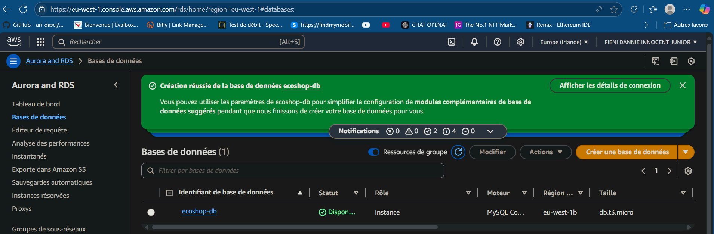

# PHASE 4: RDS DATABASE

## STEP 4.1: Create DB Subnet Group

A database subnet group was created for the RDS database, ensuring its high availability across multiple Availability Zones.

* **Name:** `ecoshop-db-subnet-group`
* **Description:** Subnet group for EcoShop database
* **VPC:** `ecosop-vpc`
* **Subnets added:**
    * Availability Zone: `us-east-1a`, Subnet: `ecosop-private-db-1a`
    * Availability Zone: `us-east-1b`, Subnet: `ecosop-private-db-1b`

## STEP 4.2: Create RDS Instance

A Multi-AZ MySQL database instance was deployed, guaranteeing data durability and high availability.

* **Creation method:** Standard create
* **Engine type:** MySQL
* **Version:** MySQL 8.0.35 (or latest)
* **Templates:** Production (or Free tier if available)
* **Settings:**
    * **DB instance identifier:** `ecoshop-db`
    * **Master username:** `admin`
    * **Credential management:** Auto-generated
    * **Master password:** `EcoShop2024!`
* **Instance configuration:**
    * **DB instance classes:** Burstable class `db.t3.micro`
* **Storage:**
    * **Storage type:** GP2
    * **Allocated storage:** 20 GB
    * **Storage autoscaling:** Disable
* **Availability & durability:**
    * **Multi-AZ deployment:** Create a standby replica
* **Connectivity:**
    * **Compute resource:** Don't connect to an EC2 compute resource
    * **Network type:** IPv4
    * **VPC:** `ecosop-vpc`
    * **DB subnet group:** `ecoshop-db-subnet-group`
    * **Public access:** No
    * **VPC security group:** `SG-Database`
    * **Availability Zone:** No preference
* **Additional configuration:**
    * **Initial database name:** `ecoshop`
    * **DB parameter group:** (default)
    * **Option group:** (default)
* **Backup:**
    * **Automated backups:** Enable
    * **Backup retention period:** 7 days
* **Monitoring:**
    * **Enhanced monitoring:** Disable
* **Maintenance:**
    * **Auto minor version upgrade:** Enable

