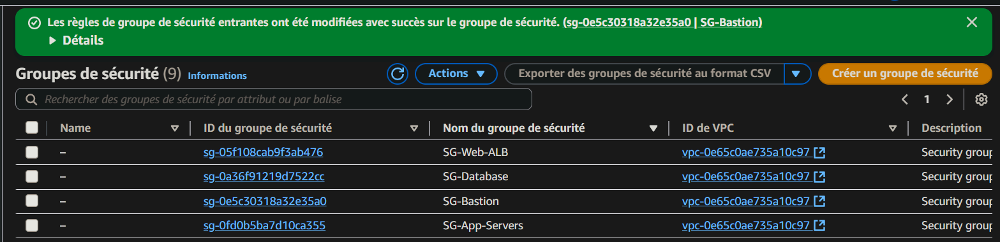

# PHASE 2: SECURITY CONFIGURATION (Security Groups)

Four security groups were created to control inbound and outbound traffic for different resources, ensuring proper segmentation and protection.

## 2.1 Security Groups to Create

* **SG-Web (Load Balancer):**
    * **Name:** `SG-Web-ALB`
    * **Description:** Security group for Application Load Balancer
    * **VPC:** `ecosop-vpc`
    * **Inbound rules:**
        * HTTP (80): `0.0.0.0/0`
        * HTTPS (443): `0.0.0.0/0`
    * **Outbound rules:** All allowed

* **SG-App (Application Servers):**
    * **Name:** `SG-App-Servers`
    * **Description:** Security group for application servers
    * **Inbound rules:**
        * Port 8080: Source `SG-Web-ALB`
        * SSH (22): Source `SG-Bastion`
        * HTTP (80): Source `SG-Web-ALB`
    * **Outbound rules:** All allowed

* **SG-DB (Database):**
    * **Name:** `SG-Database`
    * **Description:** Security group for RDS database
    * **Inbound rules:**
        * MySQL (3306): Source `SG-App-Servers`
    * **Outbound rules:** All allowed

* **SG-Bastion (Administration):**
    * **Name:** `SG-Bastion`
    * **Description:** Security group for Bastion server
    * **Inbound rules:**
        * SSH (22): `[YOUR_PUBLIC_IP]/32`
    * **Outbound rules:** All allowed

