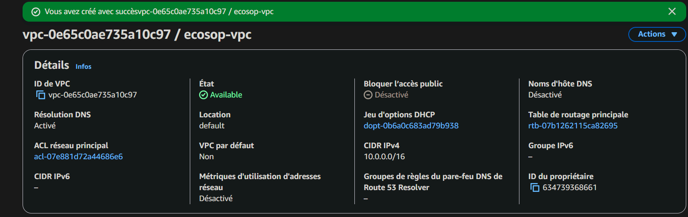
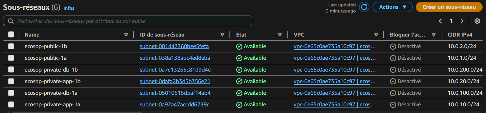
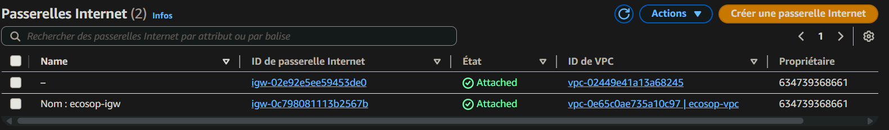
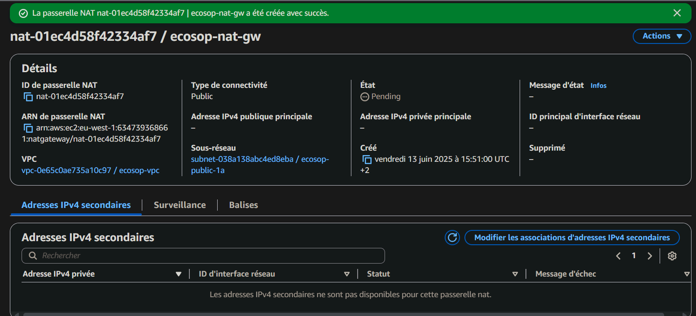
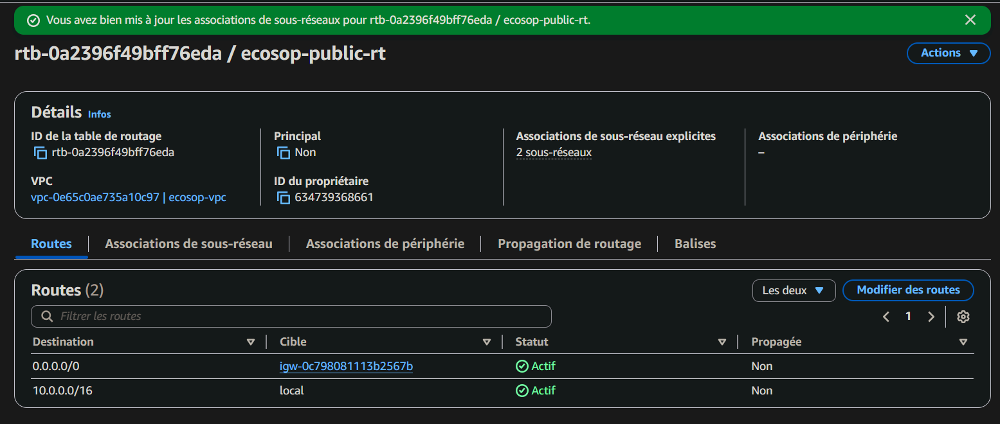
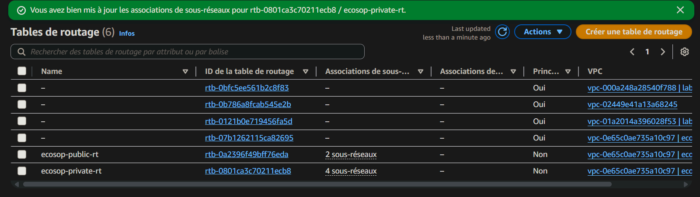

# PHASE 1: NETWORK INFRASTRUCTURE

## 1.1 Main VPC Creation

A Virtual Private Cloud (VPC) was created to host the entire Ecoshop infrastructure, providing an isolated and secure network environment.

**VPC Configuration:**
* **Name:** `ecosop-vpc`
* **IPv4 CIDR:** `10.0.0.0/16`
* **Tenancy:** Default
* **Enable DNS hostnames:** Enabled
* **Enable DNS resolution:** Enabled

## 1.2 Subnet Creation (6 subnets across 2 AZs)

Six subnets were configured and distributed across two Availability Zones (`us-east-1a` and `us-east-1b`) to ensure high availability and segmentation of the infrastructure.

| Name                        | Type   | CIDR           | AZ           | Usage     |
| :-------------------------- | :----- | :------------- | :----------- | :-------- |
| `ecosop-public-1a`          | Public | `10.0.1.0/24`  | `us-east-1a` | Web Tier  |
| `ecosop-public-1b`          | Public | `10.0.2.0/24`  | `us-east-1b` | Web Tier  |
| `ecosop-private-app-1a`     | Private | `10.0.10.0/24` | `us-east-1a` | App Tier  |
| `ecosop-private-app-1b`     | Private | `10.0.20.0/24` | `us-east-1b` | App Tier  |
| `ecosop-private-db-1a`      | Private | `10.0.100.0/24`| `us-east-1a` | DB Tier   |
| `ecosop-private-db-1b`      | Private | `10.0.200.0/24`| `us-east-1b` | DB Tier   |

## 1.3 Gateway Configuration

### Internet Gateway (IGW):

An Internet Gateway was created and attached to the VPC to enable communication between the VPC and the Internet.

* **Name:** `ecosop-igw`
* **Attached to VPC:** `ecosop-vpc`

### NAT Gateway:

A NAT Gateway was deployed in a public subnet to allow instances in private subnets to access the Internet (e.g., for software updates) without exposing these instances directly to the web.

* **Name:** `ecosop-nat-gw`
* **Subnet:** `ecosop-public-1a`
* **Connectivity type:** Public
* **Allocate Elastic IP:** Enabled

## 1.4 Route Table Configuration

### Public Route Table:

A public route table was configured to direct Internet traffic to the Internet Gateway and was associated with the public subnets.

* **Name:** `ecosop-public-rt`
* **VPC:** `ecosop-vpc`
* **Routes:**
    * `10.0.0.0/16` $\rightarrow$ Local
    * `0.0.0.0/0` $\rightarrow$ `ecosop-igw`
* **Associations:** `ecosop-public-1a`, `ecosop-public-1b`

### Private Route Table:

A private route table was configured to route outbound traffic from private subnets through the NAT Gateway.

* **Name:** `ecosop-private-rt`
* **VPC:** `ecosop-vpc`
* **Routes:**
    * `10.0.0.0/16` $\rightarrow$ Local
    * `0.0.0.0/0` $\rightarrow$ `ecosop-nat-gw`
* **Associations:** All private subnets

