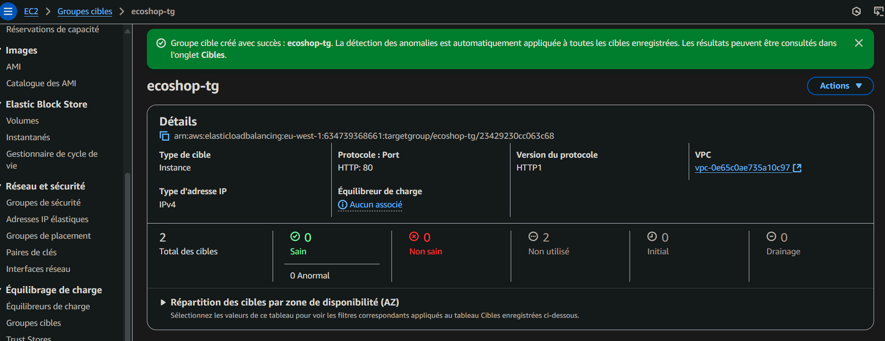

# Application Load Balancer

## STEP 5.2: Create Application Load Balancer

An Application Load Balancer (ALB) was deployed to distribute incoming web traffic among the application servers, improving fault tolerance and scalability.

* **Name:** `ecoshop-alb`
* **Scheme:** Internet-facing
* **IP address type:** IPv4
* **Network mapping:**
    * **VPC:** `ecosop-vpc`
    * **Mappings:**
        * `us-east-1a` \\rightarrow `ecosop-public-1a`
        * `us-east-1b` \\rightarrow `ecosop-public-1b`
* **Security groups:** `SG-Web-ALB`
* **Listeners and routing:**
    * **Protocol:** HTTP
    * **Port:** 80
    * **Default action:** Forward to \\rightarrow `ecoshop-tg`

