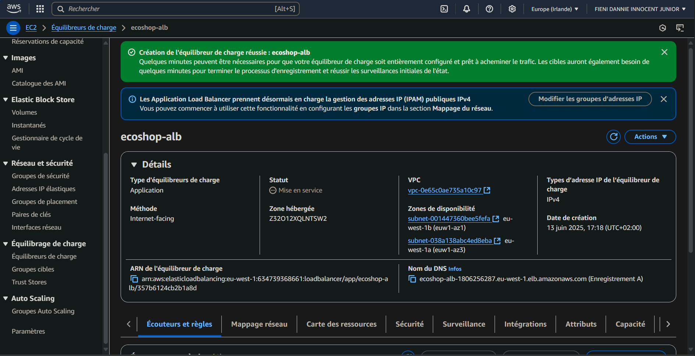

# PHASE 5: LOAD BALANCER

## STEP 5.1: Create Target Group

A target group was configured to route ALB traffic to the application servers.

* **Target type:** Instances
* **Target group name:** `ecoshop-tg`
* **Protocol:** HTTP
* **Port:** 80
* **VPC:** `ecosop-vpc`
* **Health checks:**
    * **Health check protocol:** HTTP
    * **Health check path:** `/index.php`
* **Registered targets:** `ecosop-app-server-1` and `ecosop-app-server-2`

