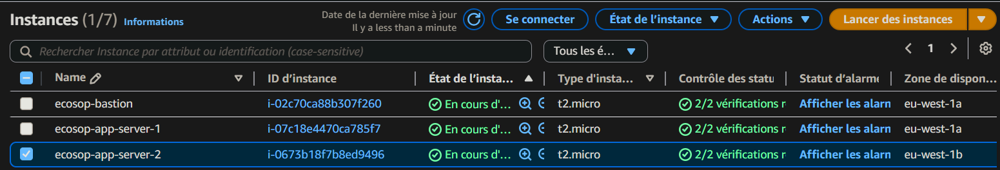

# PHASE 3: SERVER DEPLOYMENT

## 3.1 Bastion Host Creation

A Bastion host was deployed in a public subnet to enable secure SSH access to private instances.

* **Name:** `ecosop-bastion`
* **AMI:** Amazon Linux 2
* **Instance type:** `t3.micro`
* **Key pair:** [Create new key or use existing]
* **Network settings:**
    * **VPC:** `ecosop-vpc`
    * **Subnet:** `ecosop-public-1a`
    * **Public IP:** Enable
    * **Security group:** `SG-Bastion`

