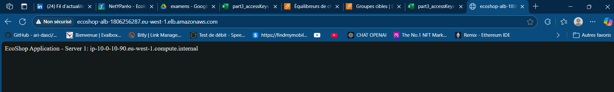

# PHASE 6: TESTS AND VALIDATION

## TEST 1: Wait for everything to be operational

Verification of the status of critical components:

1.  **Instances:** All in "running" state with `2/2` checks passed.
2.  **RDS:** Status "Available".
3.  **ALB:** Status "Active".
4.  **Target Group:** Targets healthy.

## TEST 2: Bastion Connectivity Test

SSH access to application servers from the Bastion Host:

* **Connecting to App Server 1 (10.0.10.90):**
    ```bash
    ssh ec2-user@10.0.10.90
    # ... (Amazon Linux 2 output) ...
    curl localhost
    EcoShop Application - Server 1: ip-10-0-10-90.eu-west-1.compute.internal
    ```

* **Connecting to App Server 2 (10.0.20.66):**
    ```bash
    ssh ec2-user@10.0.20.66
    # ... (Amazon Linux 2 output) ...
    curl localhost
    EcoShop Application - Server 2: ip-10-0-20-66.eu-west-1.compute.internal
    ```

## TEST 3: Application Test via ALB

The application is accessible via the Load Balancer's DNS, and requests are correctly distributed between the two application servers.

1.  Copy the Load Balancer DNS (available in the ALB console).
2.  Paste the DNS into a web browser.



## TEST 4: Database Test

Attempting to connect to the RDS database from an application server (via Bastion). The initial test failed, requiring a review of the Security Group rules.

```bash
[ec2-user@ip-10-0-1-227 ~]$ mysql -h ecoshop-db.clgoawmoq39o.eu-west-1.rds.amazonaws.com -u admin -p
Enter password:
ERROR 2003 (HY000): Can't connect to MySQL server on 'ecoshop-db.clgoawmoq39o.eu-west-1.rds.amazonaws.com' (110)
